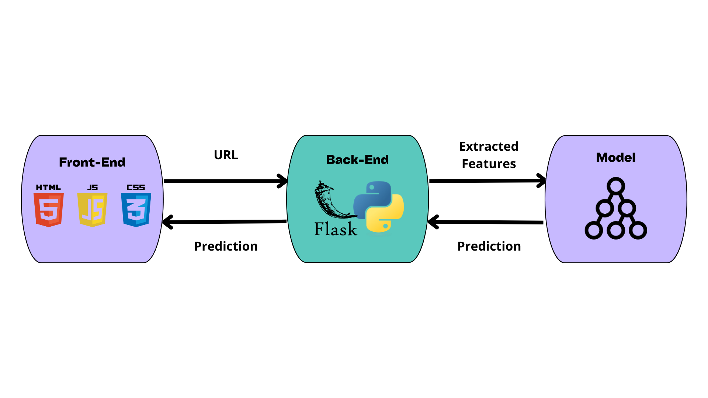

# Malicious URLs Detection using Machine Learning

<h2>Table of Contents</h2>
  <ul>
    <li><a href="#overview">Overview</a></li>
    <li><a href="#directory-structure">Directory Structure</a></li>
    <li><a href="#architecture">Architecture</a></li>
    <li><a href="#installation">Installation</a></li>
    <li><a href="#usage">Usage</a></li>
  </ul>

<h2 id="overview">Overview</h2>
  This project focuses on developing a machine learning-based system for detecting malicious URLs, which are often used in phishing, malware distribution, and other cyberattacks. The goal is to create a tool capable of classifying URLs as either benign or malicious based on patterns identified through training models.

<h2 id="directory-structure">Directory Structure</h2>


```plaintext
├── webapp/
│   ├── app.py                      # Flask application
│   ├── templates/
│   │   └── index.html              # HTML template
│   └── static/
│       ├── style.css               # Stylesheet            
│       ├── script.js               # JavaScript for frontend
│       └── image.jpg
├── src/
│   ├── __init__.py                 # Marks src as a package
│   └── Extraction_Functions.py     # Functions for feature extraction
├── Dataset.csv                     # Dataset used for model training
├── model.pkl                       # Pre-trained machine learning model
├── Malicious_URLs_Detection.ipynb  # Jupyter Notebook for model training
├── requirements.txt                
└── README.md                       # Project documentation
```


<h2 id="architecture">Architecture</h2>
  
  
<h2 id="installation">Installation</h2>
Follow these steps to set up the project environment and install the required dependencies:

1. **Clone the Repository**
   
   ```bash
   git clone https://github.com/Youssef-Daouayry/Malicious-URLs-Detection-using-Machine-Learning
   ```
3. **Navigate to the project directory**
   
   ```bash
   cd Malicious-URLs-Detection-using-Machine-Learning
   ```
5. **Install Dependencies**
   
   ```bash
   pip install -r requirements.txt
   ```

<h2 id="usage">Usage</h2>

You can now run the Flask application. Use the following command to start the web server:\

  ```bash
  python webapp/app.py
  ```

Open your web browser and navigate to ```http://localhost:5000``` to use the application.


